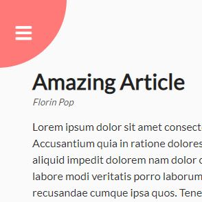
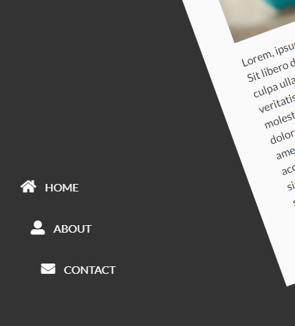
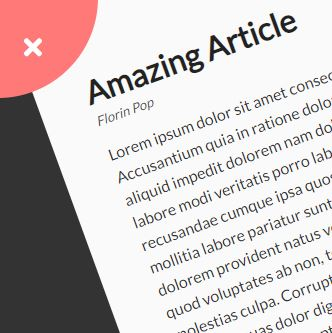

# day3 Rotating Navigation Project

This project is mostly CSS, the JS is 3mins at the end of 24 minutes of video.

### The markup

```html
 <div class="container">
      <div class="circle-container">
        <div class="circle">
          <button id="close">
            <i class="fas fa-times"></i>
          </button>
          <button id="open">
            <i class="fas fa-bars"></i>
          </button>
        </div>
      </div>

      <div class="content">
        <h1>Amazing Article</h1>
        <small>Florin Pop</small>
        <p>Lorem ipsum dolor sit amet consectetur adipisicing elit. Accusantium quia in ratione  omnis. Asperiores quia tenetur nemo ipsa.</p>

        <h3>My Dog</h3>
        
        <p>Lorem, ipsum dolor sit amet consectetur maxime similique laborum odio, magnam esse. Aperiam?</p>
      </div>
    </div>

    <nav>
      <ul>
        <li><i class="fas fa-home"></i> Home</li>
        <li><i class="fas fa-user-alt"></i> About</li>
        <li><i class="fas fa-envelope"></i> Contact</li>
      </ul>
    </nav>

```

### What JS will do for us in this project

All we will do with js is add and remove a class

* We will click the hamburger menu
* it will add class show-nav



* the nav is now showing
  


* the hamburger menu has rotated upward allowing the X to close the menu and remove the class, allowing the page to rotate to normal 
  


### Bringing the elements into our JS file

```js
// open is the hamburger
const open = document.getElementById('open')
// close is the X
const close = document.getElementById('close')
// this is the wrapper around the main content that will rotate when the show-nav class is added
const container = document.querySelector('.container')

```

### addEventListener 'click'

the hamburger/X we click in the project are in effect just buttons.

this is one of the first things we learn in JS is how to click a button to interact with the page.

In this case clicking our buttons will rotate the page and bring it back to normal.

#### Adding the show-nav class

```js
// listen for a click on the open button (hamburger).
// when clicked add class show-nav
open.addEventListener('click', () => container.classList.add('show-nav'));
```


#### Removing the show-nav class

```js
// listen for a click on the open button (hamburger).
// when clicked add class show-nav
close.addEventListener('click', () => container.classList.remove('show-nav'));
```
Once the hamburger button has been clicked above, the X button is exposed. We'll add an Event Listener to this so when it's click we'll tell it to remove the show-nav class bringing the container back to normal state.


